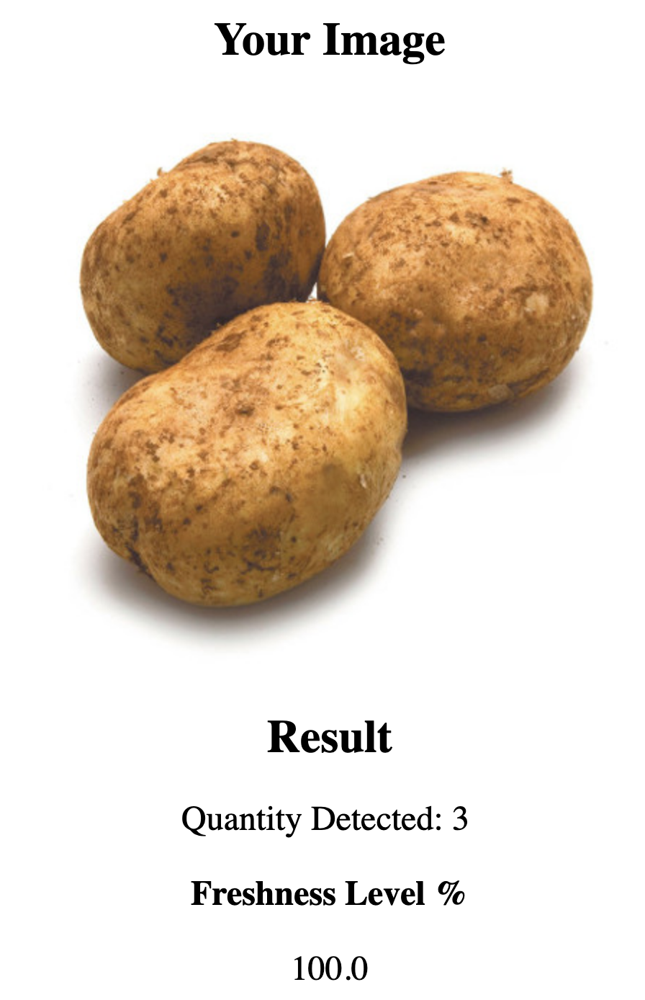

<!-- PROJECT LOGO -->
 

  
  

  HackByte 2019 hackathon project.
  

# DeepPotatoVision

<!-- ABOUT THE PROJECT -->
## About The Project
This project was created during the HackByte 2019 hackathon organized by Loblaw and Microsoft.
Deep Potato Vision provides an indicator of the level of freshness of potatoes using computer vision.

## Authors: 
* Benjamin Chew https://github.com/benjaminchew
* Dominic Amann https://github.com/dimonic
* Guillaume Castex https://github.com/gcastex
* Ilyes Baali
* Sajil Chennakuzhiyil Kuriakose https://github.com/cksajil
* Tannistha Maiti https://github.com/tannisthamaiti

## Pipeline overview

  

## Input

The input of the pipeline is a picture of potatoes, either uploaded by the user into the webapp, or captured by a physical camera.

## Detection and Segmentation

A potato detection model was built using https://www.customvision.ai/.
The model was trained to detect, classify, and compute bounding boxes for three categories of produce: potatoes, apples, and lemons.
The model is then integrated into our pipeline and pictures of potatoes are segmented into pictures of individual potatoes.

The potato detection model can be downloaded here:
https://www.dropbox.com/s/5qtv5ria8ssfx66/model.pb?dl=0

  

  

  

## Classifier

We used transfer learning with a pre-trained VGG16 classifier on which we performed fine-tuning training on a balanced dataset containing pictures of potatoes divided into two classes: "Good" and "Bad" potatoes.

The classifer model can be downloaded here:
https://ln.sync.com/dl/a2e03f960/gjp929hb-mrca7q39-f24kprzz-54czhvrt

## Webapp

A webapp provides an evaluation of the level of freshness of the batch of potatoes.
An example of the results page provided by the webapp is shown below.

  

